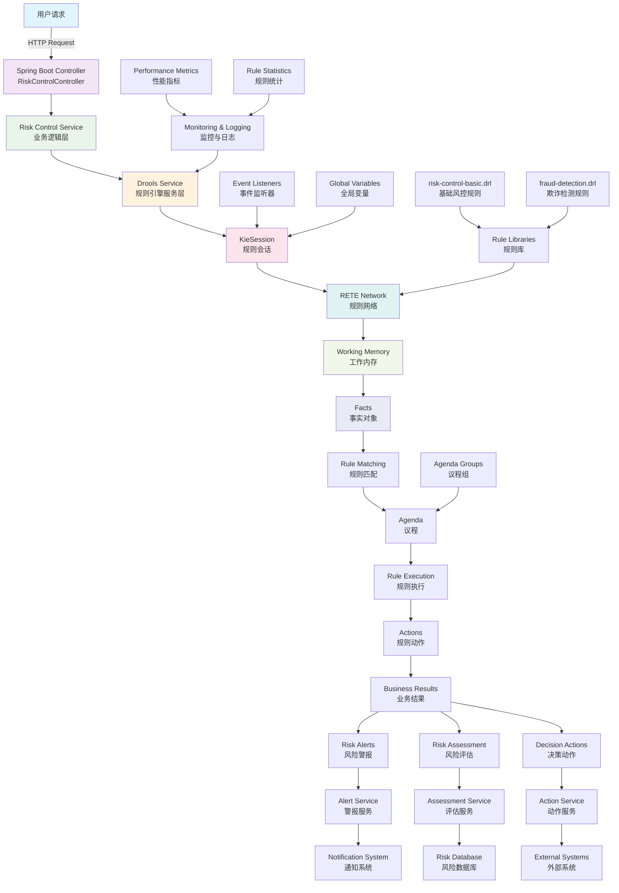

# 🚀 Drools 综合教程项目 - 风控领域实战

[](https://www.oracle.com/java/)
[](https://spring.io/projects/spring-boot)
[](https://www.drools.org/)
[](https://maven.apache.org/)
[](LICENSE)

## 📋 项目概述

这是一个全面的 Drools 学习项目，专注于金融风控领域的应用。项目包含完整的源代码、测试用例、文档和最佳实践，帮助开发者快速掌握 Drools 规则引擎的使用。

## 🎯 项目特色

- ✅ **完整的项目结构**: Maven + Spring Boot + Drools 7.74.1
- ✅ **丰富的领域模型**: 8个完整的风控领域模型
- ✅ **实战规则示例**: 基础风控、欺诈检测、信贷评估规则
- ✅ **REST API 集成**: 完整的 Spring Boot Web API
- ✅ **全面的测试覆盖**: 单元测试、集成测试、性能测试
- ✅ **详细的中文文档**: 原理解析、最佳实践、面试题
- ✅ **性能优化指南**: 常见陷阱与解决方案

## 🏗️ 项目结构

```
drools-study/
├── src/main/java/com/drools/study/
│   ├── Application.java                    # Spring Boot 启动类
│   ├── config/
│   │   └── DroolsConfig.java              # Drools 配置类
│   ├── controller/
│   │   └── RiskControlController.java     # REST API 控制器
│   ├── model/                             # 领域模型
│   │   ├── Customer.java                  # 客户模型
│   │   ├── Transaction.java               # 交易模型
│   │   ├── Account.java                   # 账户模型
│   │   ├── CreditScore.java               # 信用评分模型
│   │   ├── RiskProfile.java               # 风险档案模型
│   │   ├── RiskAlert.java                 # 风险警报模型
│   │   ├── LoanApplication.java           # 贷款申请模型
│   │   └── RiskAssessment.java            # 风险评估模型
│   └── service/
│       ├── DroolsService.java             # 规则引擎服务
│       └── RiskControlService.java        # 风控业务服务
├── src/main/resources/
│   ├── rules/
│   │   ├── risk-control-basic.drl         # 基础风控规则
│   │   └── fraud-detection.drl            # 欺诈检测规则
│   ├── application.yml                    # Spring Boot 配置
│   └── META-INF/kmodule.xml              # Drools 模块配置
├── src/test/java/com/drools/study/
│   ├── basic/
│   │   └── DroolsBasicTest.java          # 基础功能测试
│   ├── features/
│   │   └── DroolsAdvancedFeaturesTest.java # 高级特性测试
│   ├── riskcontrol/
│   │   └── RiskControlIntegrationTest.java # 集成测试
│   ├── springboot/                        # Spring Boot 集成测试
│   └── performance/                       # 性能测试
├── docs/
│   ├── principles.md                      # Drools 原理详解
│   ├── common-traps.md                    # 常见陷阱与解决方案
│   └── interview-qa-chinese.md            # 中文面试题库
├── pom.xml                               # Maven 配置
└── README.md                             # 项目说明文档
```

## 🏗️ 系统架构

下图展示了 Drools 风控系统的整体架构和数据流向：



### 架构说明

1. **Web 层**: Spring Boot Controller 接收 HTTP 请求
2. **服务层**: 
   - `RiskControlService`: 处理业务逻辑
   - `DroolsService`: 封装规则引擎操作
3. **规则引擎层**: 
   - `KieSession`: 规则会话管理
   - `RETE Network`: 高效的规则匹配网络
   - `Working Memory`: 存储事实对象和中间状态
4. **规则库**: DRL 文件定义的业务规则
5. **结果处理**: 规则执行后的业务决策和动作
6. **监控体系**: 性能监控、日志记录、统计分析

### 数据流向

1. 用户请求 → Controller → Service → Drools Engine
2. 事实对象插入工作内存 → RETE 网络匹配
3. 规则激活 → 议程排序 → 规则执行
4. 规则动作 → 业务结果 → 响应用户

## 🚀 快速开始

### 环境要求

- JDK 17+
- Maven 3.6+
- IDE (推荐 IntelliJ IDEA)

### 运行项目

1. **克隆项目**
```bash
git clone <repository-url>
cd drools-study
```

2. **编译项目**
```bash
mvn clean compile
```

3. **运行测试**
```bash
mvn test
```

4. **启动应用**
```bash
mvn spring-boot:run
```

5. **访问 API**
```
http://localhost:8080/api/risk-control/health
```

## 🔥 核心功能演示

### 1. 客户风险评估
```bash
curl -X POST http://localhost:8080/api/risk-control/customers/onboard \
  -H "Content-Type: application/json" \
  -d '{
    "customerId": "CUST001",
    "fullName": "张三",
    "creditScore": 650,
    "annualIncome": 100000,
    "isBlacklisted": false
  }'
```

### 2. 交易监控
```bash
curl -X POST http://localhost:8080/api/risk-control/transactions/process \
  -H "Content-Type: application/json" \
  -d '{
    "transaction": {
      "transactionId": "TXN001",
      "customerId": "CUST001",
      "amount": 50000,
      "timestamp": "2023-12-01T10:00:00"
    },
    "customer": {
      "customerId": "CUST001",
      "fullName": "张三"
    }
  }'
```

### 3. 贷款申请处理
```bash
curl -X POST http://localhost:8080/api/risk-control/loans/apply \
  -H "Content-Type: application/json" \
  -d '{
    "application": {
      "applicationId": "LOAN001",
      "customerId": "CUST001",
      "loanType": "PERSONAL",
      "requestedAmount": 100000
    },
    "customer": { ... },
    "creditScore": { ... }
  }'
```

## 📚 学习路径

### 初级阶段
1. 阅读 [Drools 原理详解](docs/principles.md)
2. 运行基础测试 `DroolsBasicTest`
3. 理解领域模型和基础规则

### 中级阶段
1. 学习高级特性测试 `DroolsAdvancedFeaturesTest`
2. 掌握议程组、累积函数、CEP
3. 阅读 [常见陷阱与解决方案](docs/common-traps.md)

### 高级阶段
1. 运行集成测试了解完整业务流程
2. 学习性能优化技巧
3. 准备 [面试题库](docs/interview-qa-chinese.md)

## 🔧 规则示例

### 基础风控规则
```drl
rule "检测高风险客户"
    salience 90
    agenda-group "risk-assessment"
    when
        $customer : Customer(creditScore < 600, !isBlacklisted)
    then
        RiskAlert alert = RiskAlert.builder()
            .alertId("HIGH_RISK_" + System.currentTimeMillis())
            .customerId($customer.getCustomerId())
            .alertType("HIGH_RISK_CUSTOMER")
            .severity("HIGH")
            .description("信用分数过低: " + $customer.getCreditScore())
            .status("ACTIVE")
            .build();
        
        insert(alert);
        
        modify($customer) {
            setRiskCategory("HIGH"),
            setLastRiskAssessment(LocalDateTime.now())
        }
        
        logger.info("检测到高风险客户: {}", $customer.getCustomerId());
end
```

### 欺诈检测规则
```drl
rule "检测异常交易频率"
    agenda-group "fraud-detection"
    salience 90
    when
        $customer : Customer()
        $transactions : List(size >= 5) from collect(
            Transaction(
                customerId == $customer.customerId,
                timestamp after[0s,300s] LocalDateTime.now().minusMinutes(5)
            )
        )
    then
        RiskAlert alert = RiskAlert.builder()
            .alertId("FRAUD_VELOCITY_" + System.currentTimeMillis())
            .customerId($customer.getCustomerId())
            .alertType("FRAUD_VELOCITY")
            .severity("HIGH")
            .description("5分钟内检测到 " + $transactions.size() + " 笔交易")
            .status("ACTIVE")
            .build();
        
        insert(alert);
        
        logger.warn("检测到异常交易频率: 客户 {} 在5分钟内进行了 {} 笔交易", 
                   $customer.getCustomerId(), $transactions.size());
end
```

## 🎯 API 端点

| 端点 | 方法 | 描述 |
|------|------|------|
| `/api/risk-control/health` | GET | 健康检查 |
| `/api/risk-control/customers/onboard` | POST | 客户入网风险评估 |
| `/api/risk-control/transactions/process` | POST | 交易风险监控 |
| `/api/risk-control/loans/apply` | POST | 贷款申请处理 |
| `/api/risk-control/customers/{id}/risk-profile` | GET | 获取客户风险档案 |
| `/api/risk-control/customers/{id}/alerts` | GET | 获取客户风险警报 |
| `/api/risk-control/credit-score/calculate` | POST | 信用评分计算 |
| `/api/risk-control/stats/rules` | GET | 规则执行统计 |

## 🧪 测试用例

### 基础功能测试
- ✅ 规则基本执行流程
- ✅ 事实对象增删改查
- ✅ 议程组控制
- ✅ 规则优先级测试
- ✅ 有状态vs无状态会话

### 高级特性测试
- ✅ 累积函数应用
- ✅ 复杂事件处理 (CEP)
- ✅ 全局变量使用
- ✅ 条件元素 (exists, not, forall)
- ✅ 规则修改和更新

### 集成测试
- ✅ 完整业务流程测试
- ✅ Spring Boot 集成测试
- ✅ REST API 测试
- ✅ 性能和并发测试

## 📊 性能基准

| 操作 | 平均耗时 | 吞吐量 | 备注 |
|------|----------|--------|------|
| 客户风险评估 | < 50ms | 1000 TPS | 单个客户 |
| 交易监控 | < 10ms | 5000 TPS | 单笔交易 |
| 批量处理 | < 1s | 10000 records/s | 无状态会话 |
| 规则编译 | < 2s | - | 应用启动时 |

## 🛠️ 开发工具

### 推荐 IDE 插件
- **IntelliJ IDEA**: Drools Support Plugin
- **Eclipse**: Drools and jBPM Tools
- **VS Code**: Drools Language Support

### 调试工具
- **日志配置**: 详细的规则执行日志
- **性能监控**: Spring Boot Actuator + Micrometer
- **规则调试**: 事件监听器和断点调试

## 🤝 贡献指南

1. Fork 项目
2. 创建特性分支 (`git checkout -b feature/amazing-feature`)
3. 提交改动 (`git commit -m 'Add amazing feature'`)
4. 推送分支 (`git push origin feature/amazing-feature`)
5. 创建 Pull Request

## 📄 许可证

本项目采用 MIT 许可证 - 查看 [LICENSE](LICENSE) 文件了解详情。

## 🙏 致谢

- [Drools 官方文档](https://docs.drools.org/)
- [Spring Boot 官方指南](https://spring.io/guides)
- 所有贡献者和社区成员

## 📞 联系方式

- 项目维护者: Drools Study Team
- 邮箱: drools.study@example.com
- 讨论群: 加入我们的技术交流群

---

**⭐ 如果这个项目对你有帮助，请给我们一个 Star！**

**🔔 持续关注项目更新，获取最新的 Drools 学习资源和最佳实践。** 